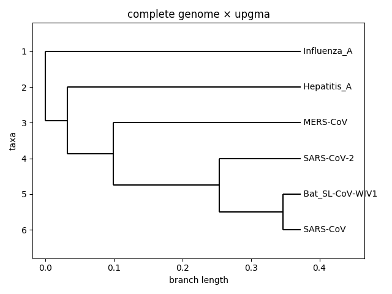
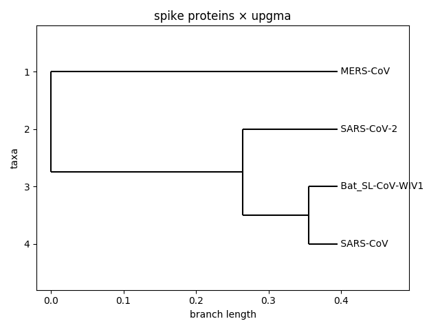
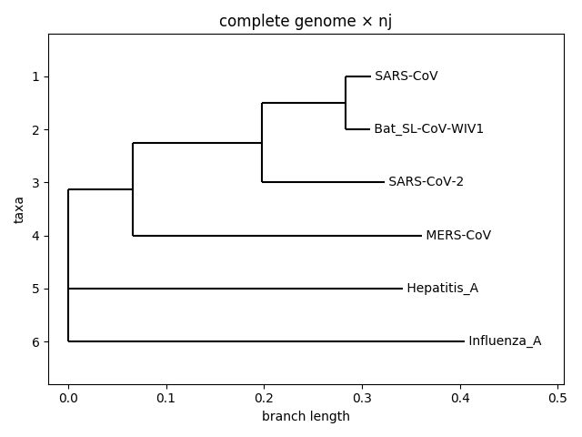
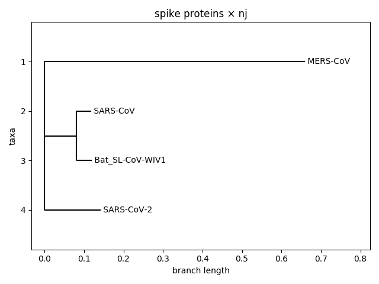

# Introduction to Computational Biology
#### Summer semester 2019/20

The aim of the course was to introduce students with a computer science and mathematics background to data-driven problems from molecular biology (focusing on analysis of protein and nucleic acid sequences). We have been presented some of the mathematical models and computational methods used today in molecular sequence analysis.

## Assignment 1 - Coronavirus phylogeny

As we are spending our time in quarantine, I thought we might try and consider reconstructing some phylogenetic trees that will tell us something about the evolutionary history of the coronavirus 2019-nCov. In particular, we will try and replicate (not completely, but the general idea) the panels b and c from Figure 2 [in this paper](http://regulomics.mimuw.edu.pl/wp/wp-content/uploads/2020/03/Identification_of_a_novel_coronavirus_causing.99423.pdf). The idea is to create and compare two phylogenetic trees created from the whole genome sequence of the coronavirus and from its [spike protein](https://www.nature.com/articles/nrmicro2090).

### Results

| tree building method | complete genome | spike protein |
|---|---|---|
| [upgma](https://en.wikipedia.org/wiki/UPGMA) |  |  |
| [nj](https://en.wikipedia.org/wiki/Neighbor_joining) |  |  |

## Assignment 2 - E. coli genome analysis

In our second assignment, we will try to combine a few of the problems we have encountered: Searching for related sequences, identifying regulatory regions and motifs and enrichment analysis.

[Full assignment available here.](project02/assignment.md)

### Results

Results are available in a report (only in Polish)

 - [as .md file](project02/raport.md)
 - [as .pdf file](project02/raport.pdf)
